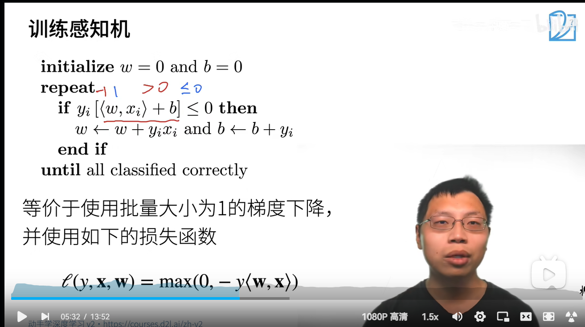
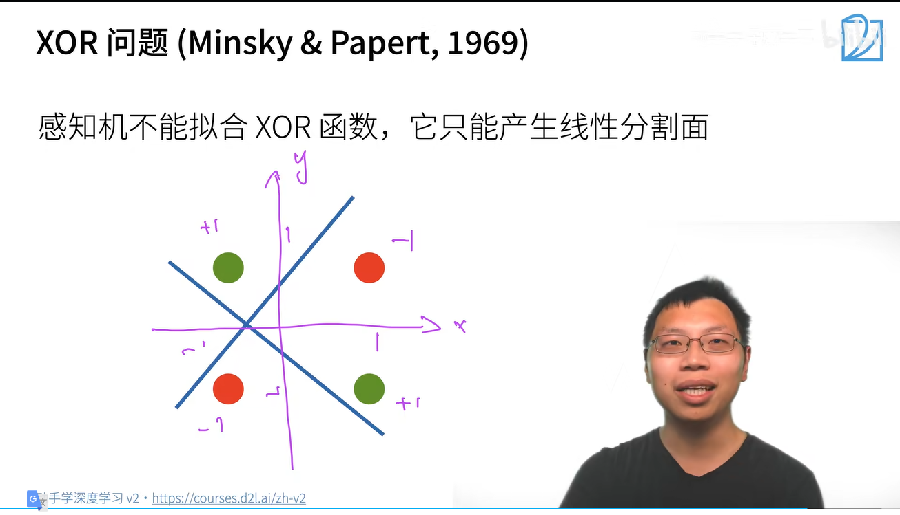
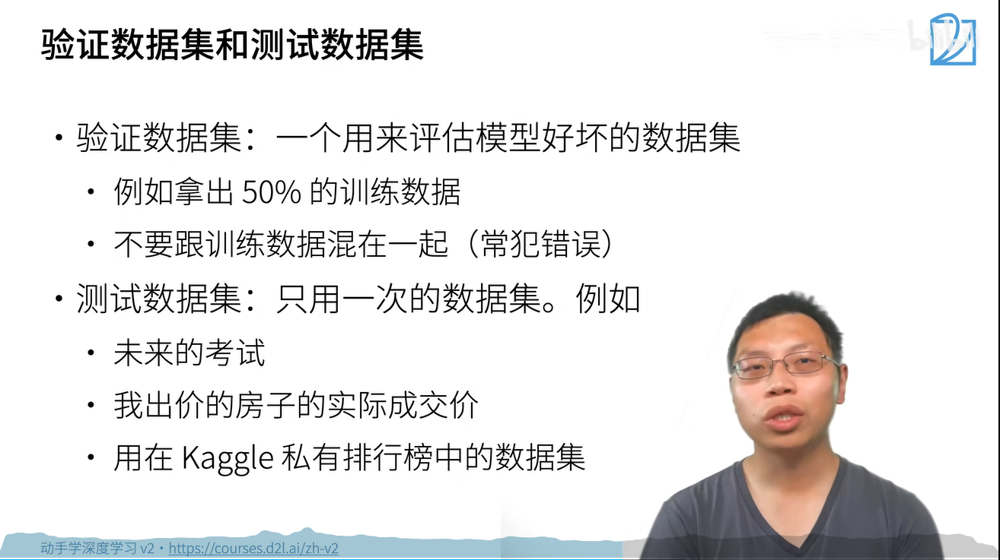
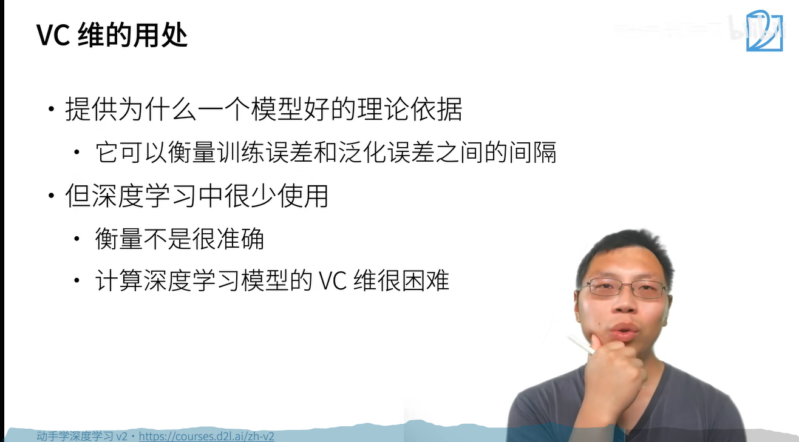

[toc]

# 00课程安排

# 01深度学习介绍

# 03安装环境

# 04数据操作

# 05 线性代数

# 06 矩阵计算

# 07 自动求导

****

 

# 09 SoftMax回归

## 损失函数

绿色：L的似然函数，e的-L次方

橙色：L的梯度。随着预测值与真实值接近，更新的幅度变小

# 10 感知机

感知机--二分类问题

## 多层感知机

机器学习本质：压缩

128维压缩到5维，慢慢压缩	所以多几层 

# 11模型选择、过拟合、欠拟合

# 12 权重衰退

